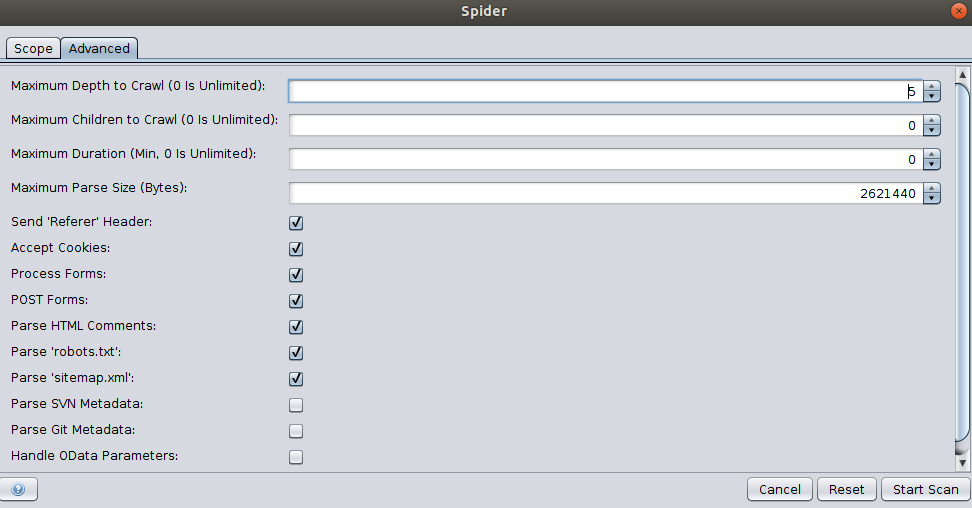
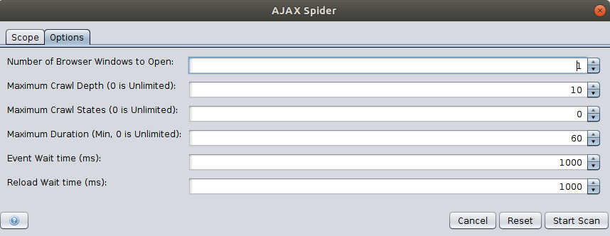

#Advanced Settings

The following section shows advanced configurations of the APIs.

##Spider

The following images shows the advanced configurations tab of Spider in the desktop UI.

Use the [setOptionMaxDepth](#spideractionsetoptionmaxdepth) to set the maximum depth the spider can crawl, where 0 refers unlimited depth. 
The [setOptionMaxChildren](#spideractionsetoptionmaxchildren) sets the maximum number of child nodes (per node) that can be crawled, 
where 0 means no limit. The [setOptionMaxDuration](#spideractionsetoptionmaxduration) API can be used to set the maximum duration the Spider will run.
Use the [setOptionMaxParseSizeBytes](#spideractionsetoptionmaxparsesizebytes) to limit the amount of data parsed by the spider. 
This allows the spider to skip big responses/files. 

View the [Spider section](#spider) in the API Catalogue for other additional APIs.

##Ajax Spider

The following images shows the advanced configurations tab of Spider in the desktop UI.

Similar to the Spider API, Ajax spider also provides APIs to set the [maximum depth](#), [crawl state](#), and [maximum duration](#).

##Passive Scan

The scanning rules can be enabled/disabled using the [enableScanners](#pscanactionenablescanners) and [disableScanners]((#pscanactiondisablescanners)) API.
Also use the [setScanOnlyInScope](#pscanviewscanonlyinscope) API to limit the passive scanning to a scope. View
the advanced section to learn how to configure a context or scope using ZAP APIs.

Passive scanning can also be used for automatically add tags and raise alerts for potential issues. A set of rules for 
automatic tagging are provided by default. These can be changed, deleted or added to via the Options Passive Scan Tags Screen.

##Active Scan

Content in progress!

