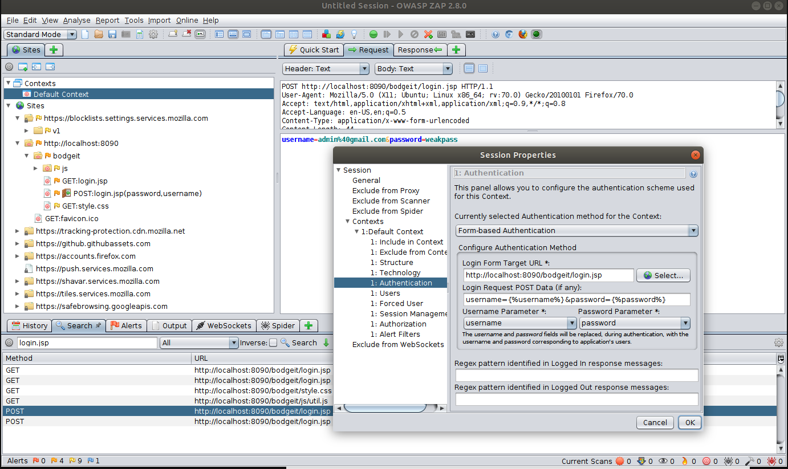

# Getting Authenticated

The target application for testing might have a portion of the functionality that is only available for a logged-in user. 
In order to get full test coverage of the application you need to test the application with a logged-in user as well. Therefore 
it's very important to understand how to perform authenticated scans with ZAP. ZAP has several means to authenticate your 
application and keep track of the authentication state. The following are some of the options available for authentication with ZAP.

- Form-based authentication
- Script-based authentication
- JSON-based authentication
- HTTP/NTLM based authentication

The examples below show three authentication workflows. A simple form-based authentication is showcased with the use of the 
Bodgeit application. The second example shows the script-based authentication using the Damn Vulnerable Web Application(DVWA). 
The third example shows a more complicated authentication workflow using the JSON and script-based authentication using the OWASP Juice Shop.

<aside class="info">
It's recommended to configure the authentication using the desktop UI before automating it using the ZAP APIs. The examples
below show how to configure authentication with ZAP desktop and provides automation scripts on how to perform the similar using 
ZAP APIs.
</aside>

## General Steps

The following are the general steps when configuring the application authentication with ZAP.

**Step 1. Define a context**

Contexts are a way of relating a set of URLs together. The URLs are defined as a set of regular expressions (regex). 
You should include the target application inside the context. The unwanted URLs such as the logout page, password change functionality
should be added to the exclude in context section.

**Step 2. Set the authentication mechanism**

Choose the appropriate login mechanism for your application. If your application supports a simple form-based login, then 
choose the form-based authentication method. For complex login workflows, you can use the script-based login to define custom 
authentication workflows.

**Step 3. Define your auth parameters**

In general, you need to provide the settings on how to communicate to the authentication service of your application. In general, 
the settings would include the login URL and payload format (username & password). The required parameters will be different 
for different authentication methods.

**Step 4. Set relevant logged in/out indicators**

ZAP additionally needs hints to identify whether the application is authenticated or not. To verify the authentication status, 
ZAP supports logged in/out regexes. These are regex patterns that you should configure to match strings in the responses which 
indicate if the user is logged in or logged out.

**Step 5. Add a valid user and password**

Add a user account (an existing user in your application) with valid credentials in ZAP. You can create multiple users 
if your application exposes different functionality based on user roles. Additionally, you should also set valid session 
management when configuring the authentication for your application. Currently, ZAP supports cookie-based session management 
and HTTP authentication based session management.
 
**Step 6. Enable forced user mode (Optional)**

Now enable the  "[Forced User Mode disabled - click to enable](https://github.com/zaproxy/zap-core-help/wiki/HelpUiTltoolbar#--forced-user-mode-on--off)" 
button. Pressing this button will cause ZAP to resend the authentication request whenever it detects that the user is no 
longer logged in, ie by using the 'logged in' or 'logged out' indicator. But the forced used mode is ignored for scans that already have a user set. 

<aside class="info">
In order for auth to work one of the indicators(logged in/out) needs to be set, however, ZAP will allow users to proceed without having to set 
them because there are other methods of setting them. However, if one isn't set, then the auth won't work.
</aside>

## Form Based Authentication

```python
#!/usr/bin/env python
import urllib.parse
from zapv2 import ZAPv2

context_id = 1
apiKey = 'changeMe'
context_name = 'Default Context'
target_url = 'http://localhost:8090/bodgeit'

# By default ZAP API client will connect to port 8080
zap = ZAPv2(apikey=apiKey)


# Use the line below if ZAP is not listening on port 8080, for example, if listening on port 8090
# zap = ZAPv2(apikey=apikey, proxies={'http': 'http://127.0.0.1:8090', 'https': 'http://127.0.0.1:8090'})

def set_include_in_context():
    exclude_url = 'http://localhost:8090/bodgeit/logout.jsp'
    include_url = 'http://localhost:8090/bodgeit.*'
    zap.context.include_in_context(context_name, include_url, apiKey)
    zap.context.exclude_from_context(context_name, exclude_url, apiKey)
    print('Configured include and exclude regex(s) in context')


def set_logged_in_indicator():
    logged_in_regex = '\Q<a href="logout.jsp">Logout</a>\E'
    zap.authentication.set_logged_in_indicator(context_id, logged_in_regex, apiKey)
    print('Configured logged in indicator regex: ')


def set_form_based_auth():
    login_url = 'http://localhost:8090/bodgeit/login.jsp'
    login_request_data = 'username=&password='
    form_based_config = 'loginUrl=' + urllib.parse.quote(login_url) + '&loginRequestData=' + urllib.parse.quote(login_request_data)
    zap.authentication.set_authentication_method(context_id, 'formBasedAuthentication', form_based_config, apiKey)
    print('Configured form based authentication')


def set_user_auth_config():
    user = 'Test User'
    username = 'test@example.com'
    password = 'weakPassword'

    user_id = zap.users.new_user(context_id, user, apiKey)
    user_auth_config = 'username=' + urllib.parse.quote(username) + '&password=' + urllib.parse.quote(password)
    zap.users.set_authentication_credentials(context_id, user_id, user_auth_config, apiKey)
    zap.users.set_user_enabled(context_id, user_id, 'true', apiKey)
    zap.forcedUser.set_forced_user(context_id, user_id, apiKey)
    zap.forcedUser.set_forced_user_mode_enabled('true', apiKey)
    print('User Auth Configured')
    return user_id


def start_spider(user_id):
    zap.spider.scan_as_user(context_id, user_id, target_url, recurse='true')
    print('Started Scanning with Authentication')


set_include_in_context()
set_form_based_auth()
set_logged_in_indicator()
user_id_response = set_user_auth_config()
start_spider(user_id_response)

```

```java
public class FormAuth {

    private static final String ZAP_ADDRESS = "localhost";
    private static final int ZAP_PORT = 8080;
    private static final String ZAP_API_KEY = null;
    private static final String contextId = "1";
    private static final String contextName = "Default Context";
    private static final String target = "http://localhost:8090/bodgeit";

    private static void setIncludeAndExcludeInContext(ClientApi clientApi) throws UnsupportedEncodingException, ClientApiException {
        String includeInContext = "http://localhost:8090/bodgeit.*";
        String excludeInContext = "http://localhost:8090/bodgeit/logout.jsp";

        clientApi.context.includeInContext(contextName, includeInContext);
        clientApi.context.excludeFromContext(contextName, excludeInContext);
    }


    private static void setLoggedInIndicator(ClientApi clientApi) throws UnsupportedEncodingException, ClientApiException {
        // Prepare values to set, with the logged in indicator as a regex matching the logout link
        String loggedInIndicator = "<a href=\"logout.jsp\">Logout</a>";

        // Actually set the logged in indicator
        clientApi.authentication.setLoggedInIndicator(ZAP_API_KEY, contextId, java.util.regex.Pattern.quote(loggedInIndicator));

        // Check out the logged in indicator that is set
        System.out.println("Configured logged in indicator regex: "
                + ((ApiResponseElement) clientApi.authentication.getLoggedInIndicator(contextId)).getValue());
    }

    private static void setFormBasedAuthenticationForBodgeit(ClientApi clientApi) throws ClientApiException,
            UnsupportedEncodingException {
        // Setup the authentication method

        String loginUrl = "http://localhost:8090/bodgeit/login.jsp";
        String loginRequestData = "username=&password=";

        // Prepare the configuration in a format similar to how URL parameters are formed. This
        // means that any value we add for the configuration values has to be URL encoded.
        StringBuilder formBasedConfig = new StringBuilder();
        formBasedConfig.append("loginUrl=").append(URLEncoder.encode(loginUrl, "UTF-8"));
        formBasedConfig.append("&loginRequestData=").append(URLEncoder.encode(loginRequestData, "UTF-8"));

        System.out.println("Setting form based authentication configuration as: "
                + formBasedConfig.toString());
        clientApi.authentication.setAuthenticationMethod(ZAP_API_KEY, contextId, "formBasedAuthentication",
                formBasedConfig.toString());

        // Check if everything is set up ok
        System.out
                .println("Authentication config: " + clientApi.authentication.getAuthenticationMethod(contextId).toString(0));
    }

    private static String setUserAuthConfigForBodgeit(ClientApi clientApi) throws ClientApiException, UnsupportedEncodingException {
        // Prepare info
        String user = "Test User";
        String username = "test@example.com";
        String password = "weakPassword";

        // Make sure we have at least one user
        String userId = extractUserId(clientApi.users.newUser(ZAP_API_KEY, contextId, user));

        // Prepare the configuration in a format similar to how URL parameters are formed. This
        // means that any value we add for the configuration values has to be URL encoded.
        StringBuilder userAuthConfig = new StringBuilder();
        userAuthConfig.append("username=").append(URLEncoder.encode(username, "UTF-8"));
        userAuthConfig.append("&password=").append(URLEncoder.encode(password, "UTF-8"));

        System.out.println("Setting user authentication configuration as: " + userAuthConfig.toString());
        clientApi.users.setAuthenticationCredentials(ZAP_API_KEY, contextId, userId, userAuthConfig.toString());
        clientApi.users.setUserEnabled(contextId, userId, "true");
        clientApi.forcedUser.setForcedUser(contextId, userId);
        clientApi.forcedUser.setForcedUserModeEnabled(true);

        // Check if everything is set up ok
        System.out.println("Authentication config: " + clientApi.users.getUserById(contextId, userId).toString(0));
        return userId;
    }

    private static String extractUserId(ApiResponse response) {
        return ((ApiResponseElement) response).getValue();
    }

    private static void scanAsUser(ClientApi clientApi, String userId) throws ClientApiException {
        clientApi.spider.scanAsUser(contextId, userId, target, null, "true", null);
    }

    /**
     * The main method.
     *
     * @param args the arguments
     * @throws ClientApiException
     * @throws UnsupportedEncodingException
     */
    public static void main(String[] args) throws ClientApiException, UnsupportedEncodingException {
        ClientApi clientApi = new ClientApi(ZAP_ADDRESS, ZAP_PORT);

        setIncludeAndExcludeInContext(clientApi);
        setFormBasedAuthenticationForBodgeit(clientApi);
        setLoggedInIndicator(clientApi);
        String userId = setUserAuthConfigForBodgeit(clientApi);
        scanAsUser(clientApi, userId);
    }
}
```


```shell
# To include in default context
curl 'http://localhost:8080/JSON/context/action/includeInContext/?contextName=Default+Context&regex=http%3A%2F%2Flocalhost%3A8090%2Fbodgeit.*'

# Set login details (URL Endoded)
curl 'http://localhost:8080/JSON/authentication/action/setAuthenticationMethod/?contextId=1&authMethodName=formBasedAuthentication&authMethodConfigParams=loginUrl%3Dhttp%3A%2F%2Flocalhost%3A8090%2Fbodgeit%2Flogin.jsp%26loginRequestData%3Dusername%253D%257B%2525username%2525%257D%2526password%253D%257B%2525password%2525%257D'

# To set the login indicator
curl 'http://localhost:8080/JSON/authentication/action/setLoggedInIndicator/?contextId=1&loggedInIndicatorRegex=%5CQ%3Ca+href%3D%22logout.jsp%22%3ELogout%3C%2Fa%3E%5CE'

# To create a user (The first user id is: 0)
curl 'http://localhost:8080/JSON/users/action/newUser/?contextId=1&name=Test+User'

# To add the credentials for the user
curl 'http://localhost:8080/JSON/users/action/setAuthenticationCredentials/?contextId=1&userId=0&authCredentialsConfigParams=username%3Dtest%40example.com%26password%3DweakPassword'

# To enable the user
curl 'http://localhost:8080/JSON/users/action/setUserEnabled/?contextId=1&userId=0&enabled=true'

# To set forced user
curl 'http://localhost:8080/JSON/forcedUser/action/setForcedUser/?contextId=1&userId=0'

# To enable forced user mode
curl 'http://localhost:8080/JSON/forcedUser/action/setForcedUserModeEnabled/?boolean=true'
```

The following example performs a simple [form-based authentication]((https://github.com/zaproxy/zaproxy/wiki/FAQformauth)) using 
the Bodgeit vulnerable application. It's recommended that you configure the authentication via the desktop UI before attempting the APIs.

### Setup Target Application

Bodgeit uses a simple form-based authentication to authenticate the users to the application. Use the following command 
to start a docker instance of the Bodgeit application: `docker run --rm -p 8090:8080 -i -t psiinon/bodgeit` 

### Register a User

Register a user in the application by navigating to the following URL: [http://localhost:8090/bodgeit/register.jsp](http://localhost:8090/bodgeit/register.jsp).
For the purpose of this example, use the following credentials.

* username: test@gmail.com
* password: weakPass

### Login

After registering the user, browse (proxied via ZAP) to the following URL ([http://localhost:8090/bodgeit/login.jsp](http://localhost:8090/bodgeit/login.jsp)), 
and log in to the application. When you log in to the application, the request will be added to the `History` tab in ZAP. 
Search for the POST request to the following URL: [http://localhost:8090/bodgeit/login.jsp](http://localhost:8090/bodgeit/login.jsp).
Right-click on the post request, and select `Flag as Context -> Default Context : Form based Login Request` option. This will 
open the context authentication editor. You can notice it has auto-selected the form-based authentication, auto-filled the login URL, and the post data.
Select the correct form parameter as the username and password in the dropdown and click Ok.

Now you need to inform ZAP whether the application is logged in or out. The Bodgeit application includes the logout URL 
`<a href="logout.jsp">Logout</a>` as the successful response. You can view this by navigating to the response tab of the login request.
Highlight the text and right click and select the `Flag as Context -> Default Context, Loggedin Indicator` option. This will autofill
the regex needed for the login indicator. The following image shows the completed set up for the authentication tab of the context menu.



Now let's add the user credentials by going to the `context -> users -> Add` section. After adding the credentials, enable 
the  "[Forced User](https://github.com/zaproxy/zap-core-help/wiki/HelpUiTltoolbar#--forced-user-mode-on--off)"
mode in the desktop UI to forcefully authenticate the user prior to the testing of the application. 

Now let's test the authentication by performing an authenticated Spidering with ZAP. To accomplish this, go to the Spider and select the `default` 
context and the `test user` to perform the authentication. After this, you should see the Spider crawling all the protected resources.

<aside class="info">
It's not madatory to set the forced used mode, if you manually set a user for ZAP activities such as scanning.
</aside>

### Steps to Reproduce via API

If you have configured the authentication via the desktop UI, then export the context and import it using the 
[importContext](#contextactionimportcontext) API. Otherwise follow the steps below to configure the authentication setting for the context. 

#### Include in Context

Inorder to proceed with authentication, the URL of the application should be added to the context. As the Bodgit is available
via [http://localhost:8090/bodgeit](http://localhost:8090/bodgeit) use the [includeInContext](#contextactionincludeincontext) API to add the
URL to a context.

#### Set Authentication Method

Use the [setAuthenticationMethod](#authenticationactionsetauthenticationmethod) to set up the authentication method and 
the configuration parameters. The `setAuthenticationMethod` takes `contextId`, `authMethodName`, and `authMethodConfigParams` as
parameters. As Bodgeit uses the form-based authentication, use `formBasedAuthentication` for the authMethodName and use the contextID
from Step 1 as the `contextId` parameter. 

The authMethodConfigParams requires the loginUrl and loginRequestData. Therefore you should set the values to authMethodConfigParams in the following format:

`authMethodConfigParams : loginUrl=http://localhost:8090/bodgeit/login.jsp&loginRequestData=username%3D%7B%25username%25%7D%26password%3D%7B%25password%25%7D`

The values for authMethodConfigParams parameters must be URL encoded, in this case loginRequestData is `username=&password=`.

#### Set Login and Logout Indicators

Use the [setLoggedOutIndicator](#authenticationactionsetloggedoutindicator) to set the logout indicators of the application.
The Following is the regex command to match the successful response with the Bodgeit application.
`\Q<a href=\"logout.jsp\"></a>\E`

#### Create User and Enable Forced User Mode

Now add the user credentials via the [setAuthenticationCredentials](#usersactionsetauthenticationcredentials) API and use
the [SetForcedUserModeEnabled](#forceduseractionsetforcedusermodeenabled) to enable the forced user mode in ZAP.
