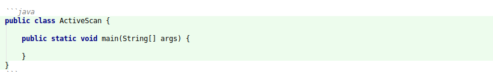

#Contributions Welcome!

Contributions are welcome! There are many ways you can contribute to OWASP ZAP, both as a user and as a developer.

**1. Creating High-level API/Automation Docs**

    Create high level docs or example guides on how to use the APIs to perform any action/view with ZAP.
    The source files for the ZAP API documentation is hosted on Github. The repository is available at [Github](https://github.com/zaproxy/zap-api-docs).
    The source files are in `Markdown` (md) format.
    
**2. REST API Documentation**

    ZAP's rest API is documented using the Open API specification. The specification could be improved by enhacing the description of 
    parameters/ results/ data types etc. The open API specification is avaiable in [Github](https://github.com/zaproxy/zap-api-docs/blob/master/openapi.yaml).

**3. Feature Documentation**

    Feature documentation related to the ZAP is available on [ZAP wiki](https://github.com/zaproxy/zaproxy/wiki), 
    [ZAP user guide](https://github.com/zaproxy/zap-core-help/wiki), and [ZAP extensions](https://github.com/zaproxy/zap-extensions/wiki) repositories.

## How to Contribute

The ZAP API documentation is developed according to the [docs as code](https://www.writethedocs.org/guide/docs-as-code/) philosophy.
The most direct and effective way to contribute to the docs is to submit a pull request(PR) or raise an 
issue in the Github repository containing the docs content that you want to change.

There are 2 different workflows which you can use to make changes or PRs. Use what you are most comfortable with!

**1. "Edit this File on Github" Option**
    
You can edit the documentation in the browser via navigating to the relevant source file and clicking the edit this file button.
This workflow is recommended for minor changes. For example correcting typos/spellings/grammar etc.
For extensive changes, please use the local setup and editing option.

**2. Local Setup and Editing**
    
You can fork the repository on Github and submit the changes via [pull requests](https://help.github.com/en/articles/creating-a-pull-request-from-a-fork). 
Please see the local setup for API docs section to setup and render the docs locally.

<aside class="notice">
The API documentation (this document) is built from the master branch of ZapDocs using Slate.
</aside>

## Local Setup for API Docs

ZAP uses git for its code repository. 
To submit a documentation update, use the following steps:

**1. Clone the ZAP Docs repository:** 
    `git clone https://github.com/zaproxy/zap-api-docs`
   
**2. Navigate to the cloned repository:** 
    `cd zapdocs`
    
**3. Use the following guide to install [Ruby](https://www.ruby-lang.org/en/documentation/installation/)**

**4. To install the dependencies:** `$ bundle install`
        
**5. To start the server:** `$ bundle exec middleman server`

## Documentation Style

This style guide provides a set of editorial guidelines for anyone writing documentation for OWASP ZAP.

### General Guidelines

* Check for the grammar and spellings before sending the pull request. Most of the modern editors comes with a spell 
check option or plugin.

* Use a friendly and conversational tone. Always use simple sentences. If the sentence is lengthy try to break it in to smaller sentences. 
Also avoid sentences with complicated words or jargon.

* Write positively and avoid using negative sentences.

  - Recommended: If you are not familiar with the Spider, then read this documentation.
  - Not Recommended: Read this documentation to get familiarized with the Spider.

* The documentation should be neutral, without judgments, opinions. For example, words like "easily" or "simple" come with 
a lot of assumptions. Things that are easier for you might be difficult for another person. Avoid this type of wordings 
when contributing to the document.

### Language and Grammar

* Abbreviation

    Spell out the abbreviation or acronym before introducing them in the sentence. If the abbreviation is well known such as
    API or ZAP or HTML, you can use it without spelling it first.

* Active Voice

    In general use active voice when formulating the sentence instead of passive voice. A sentence written in the active voice will emphasize 
    the person or thing who is performing an action (eg.The dog chased the ball).  In contrast, the passive voice will highlight 
    the recipient of the action (The ball was chased by the dog). Therefor use the passive voice, only when it's less important 
    who or what completed the action and more important that the action was completed. For example:
    
    - Recommended: The Spider crawls the URLs.
    - Not recommended: The URLs are crawled by the Spider. 

* Gender References

    Use gender neutral pronouns (they/their/them) when referring to a hypothetical person such as "a user with a logged in session". 
    For example, instead of:
        - he or she, use they;
        - him or her, use them;
        - his or her, use their;
        - his or hers, use theirs;
        - himself or herself, use themselves;

* Method Description

    When you're writing reference documentation for a method, phrase the main method description in terms of what it does 
    ("Gets," "Starts," "Creates," "Lists"), rather than what the developer would use it to do ("Get," "Start," "Create," "List").
    
    - Recommended: action.scan: Starts the Spider on the specified URL. 
    - Not recommended: action.scan: Start the Spider on the specified URL. 

* Second Person

    In general, use second person in your docs rather than first person. For example:
    
    - Recommended: You are recommended to use the Spider.
    - Not Recommended: We recommend to use the Spider.  

* Spellings

    Use [American spellings](https://www.oxfordinternationalenglish.com/differences-in-british-and-american-spelling/) when
    contributing to the documentation. 
 
### Formatting

* Capitalization:

    * Use the Chicago manual for capitalization rules for the documentation.
    
    * For titles of a section, Capitalize of the first letter of each word except for the [closed-class words](http://babelnet.sbg.ac.at/themepark/grammar/classes.htm) 
      such as determiners, pronouns, conjunctions, and prepositions. Use the following [link](https://capitalizemytitle.com/#Chicago) for guidance.
      - Recommended: The Spider Tutorial **with** APIs
      
    * For normal sentences don't [capitalize](https://www.grammarly.com/blog/capitalization-rules/) random words in the middle of the sentences.
    
* Number formatting   
    * In general spell out the number if it starts a sentence or is less than ten or an ordinal number. 
      - Recommended: Seventeen requests has been intercepted by the passive scanner. 
      - Recommended: The passive scan showed nine warnings.    
      - Recommended: The fifth alert was a high priority alert.  
       
    * Use numerals for numbers higher than ten or fractions or unit prices.
     - Recommended: The active scanner detected 24 issues.
     - Recommended: The scanner took 23.4 seconds to complete the crawling.

### Punctuation
    
*  Commas
  *Use oxford commas when writing a list of three or more items
      - Recommended: The API can return the results in XML, JSON, and HTML.
      - Not Recommended: The API can return the results in XML, JSON and HTML.  

*  Periods
  * Do not add period to headings or titles.  
  * Avoid using periods at the end of URLs. Try to modify the sentence so the URL can be in the middle of the sentence.
    
## Markdown Syntax

The API docs are created using standard markdown files. This section contains information regarding the syntax and linting of the Markdown files.
Refer the [Slate documentation](https://github.com/slatedocs/slate/wiki/Markdown-Syntax). Also Refer this 
[document](https://github.com/markdownlint/markdownlint/edit/master/docs/RULES.md) to properly lint the Markdown files.

### Writing Code

**Inline Code**

Put \``backticks`\` around the following symbols when used in text:

* Data types: `json`, `xml`, `html`
* File name: `test.py`, `/path-to-your-data/xml/example-name`

**Code Block**                                              

Use three back ticks to open and close a code block. Specify the programming language after the first backtick group. 
The documentation currently supports `python`, `java`, and `shell` languages.

