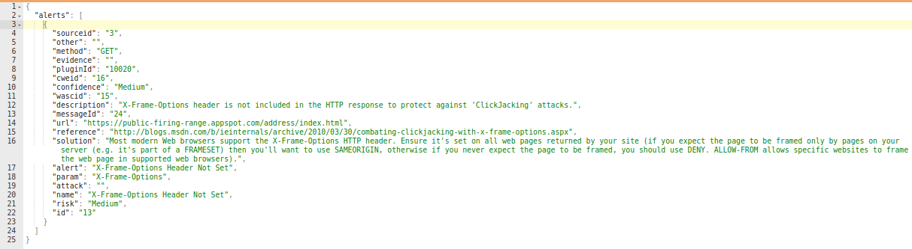
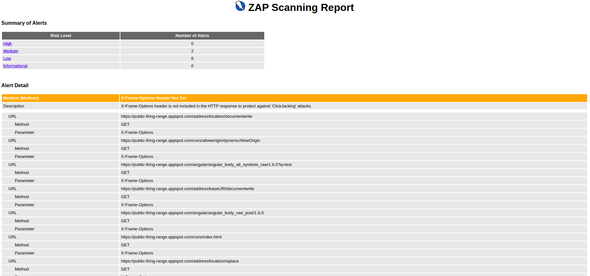

# Getting the Results

```python
#!/usr/bin/env python
from zapv2 import ZAPv2

# The URL of the application to be tested
target = 'https://public-firing-range.appspot.com'
# Change to match the API key set in ZAP, or use None if the API key is disabled
apiKey = 'changeMe'

# By default ZAP API client will connect to port 8080
zap = ZAPv2(apikey=apiKey)
# Use the line below if ZAP is not listening on port 8080, for example, if listening on port 8090
# zap = ZAPv2(apikey=apiKey, proxies={'http': 'http://127.0.0.1:8090', 'https': 'http://127.0.0.1:8090'})

# TODO: Check if the scanning has completed

# Retrieve the alerts using paging in case there are lots of them
st = 0
pg = 5000
alert_dict = {}
alert_count = 0
alerts = zap.alert.alerts(baseurl=target, start=st, count=pg)
blacklist = [1,2]
while len(alerts) > 0:
    print('Reading ' + str(pg) + ' alerts from ' + str(st))
    alert_count += len(alerts)
    for alert in alerts:
        plugin_id = alert.get('pluginId')
        if plugin_id in blacklist:
            continue
        if alert.get('risk') == 'High':
            # Trigger any relevant postprocessing
            continue
        if alert.get('risk') == 'Informational':
            # Ignore all info alerts - some of them may have been downgraded by security annotations
            continue
    st += pg
    alerts = zap.alert.alerts(start=st, count=pg)
print('Total number of alerts: ' + str(alert_count))
```

```java
public class Alerts {

    private static final String ZAP_ADDRESS = "localhost";
    private static final int ZAP_PORT = 8080;
    // Change to match the API key set in ZAP, or use NULL if the API key is disabled
    private static final String ZAP_API_KEY = "change me";
    // The URL of the application to be tested
    private static final String TARGET = "https://public-firing-range.appspot.com";

    private static List<String> blackListPlugins = Arrays.asList("1000", "1025");


    public static void main(String[] args) {
        ClientApi api = new ClientApi(ZAP_ADDRESS, ZAP_PORT, ZAP_API_KEY);

        try {
            // TODO: Check if the scanning has completed

            // Retrieve the alerts using paging in case there are lots of them
            int start = 0;
            int count = 5000;
            int alertCount = 0;
            ApiResponse resp = api.alert.alerts(TARGET, String.valueOf(start), String.valueOf(count), null);

            while (((ApiResponseList) resp).getItems().size() != 0) {
                System.out.println("Reading " + count + " alerts from " + start);
                alertCount += ((ApiResponseList) resp).getItems().size();

                for (ApiResponse l : (((ApiResponseList) resp).getItems())) {

                    Map<String, ApiResponse> element = ((ApiResponseSet) l).getValuesMap();
                    if (blackListPlugins.contains(element.get("pluginId").toString())) {
                        // TODO: Trigger any relevant postprocessing
                    } else if ("High".equals(element.get("risk").toString())) {
                        // TODO: Trigger any relevant postprocessing
                    } else if ("Informational".equals(element.get("risk").toString())) {
                        // TODO: Ignore all info alerts - some of them may have been downgraded by security annotations
                    }
                }
                start += count;
                resp = api.alert.alerts(TARGET, String.valueOf(start), String.valueOf(count), null);
            }
            System.out.println("Total number of Alerts: " + alertCount);

        } catch (Exception e) {
            System.out.println("Exception : " + e.getMessage());
            e.printStackTrace();
        }
    }
}
```

```shell
# To view the alerts
$ curl "http://localhost:8080/JSON/alert/view/alerts/?apikey=<ZAP_API_KEY>&baseurl=<BASE_URL>&start=0&count=5000&riskId="

# To view the summary of the alerts
$ curl "http://localhost:8080/JSON/alert/view/alertsSummary/?apikey=<ZAP_API_KEY>baseurl=<BASE_URL>"

# To view alerts by risk category
$ curl "http://localhost:8080/JSON/alert/view/alertsByRisk/?apikey=<ZAP_API_KEY>&url=<BASE_URL>&recurse="
```

After the scanning (Active/Passive) completes, ZAP provides the security vulnerabilities in the form of alerts. The alerts
are categorized into high-priority, medium-priority, low-priority and informational priority risks. The priority indicates the degree of risk associated with each alert. 
For example, a high priority risk means that the issues listed in that category has more threat or risk potential than a medium-priority alert.
 
The [alerts](#alertviewalerts) endpoint provides all the alerts which are identified by ZAP. View the sample code on the right to retrieve the 
alerts from the alerts endpoint. The results can be used to raise security alerts in the CI/CD pipeline or to trigger any custom workflows. 



The [alerts summary](#alertviewalertssummary) gets the number of alerts grouped by each risk level and optionally filtering by URL.
A Summary report can be also generated using the core module. Use the [htmlreport](#coreotherhtmlreport) 
or [jsonreport](#coreotherjsonreport) or [xmlreport](#coreotherxmlreport) endpoint to generate this summary report. 
The following image shows the report generated via the HTML report API. The report categories the alerts to risk level 
and provides a brief description about each alert. 


