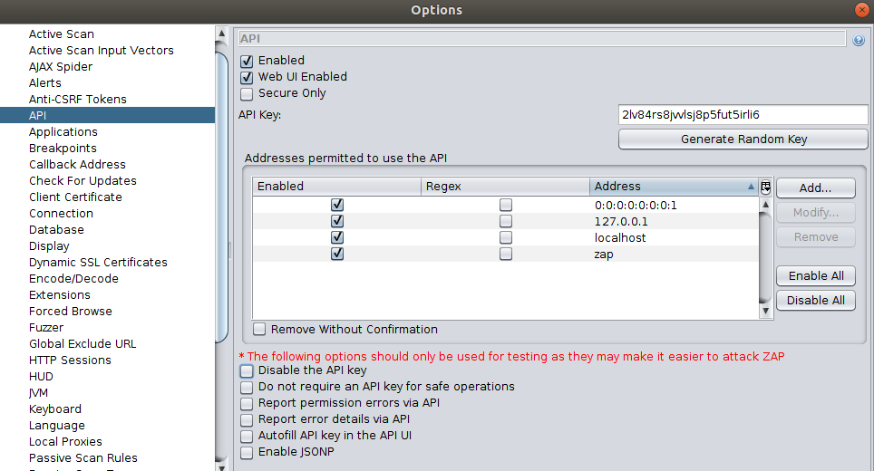
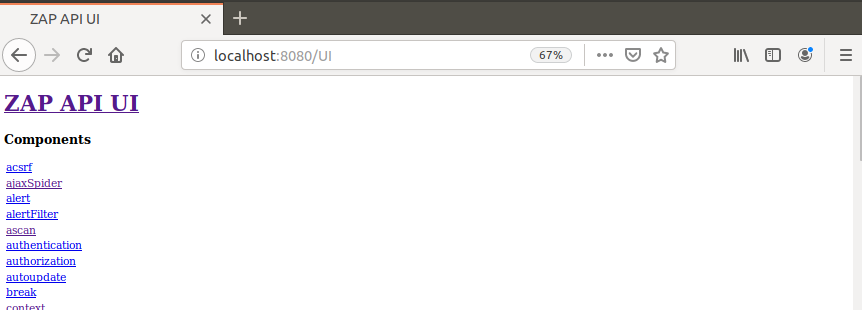

# Introduction

## Overview

Welcome to ZAP API Documentation! The [OWASP Zed Attack Proxy](https://www.owasp.org/index.php/OWASP_Zed_Attack_Proxy_Project) (**ZAP**) 
is one of the world's most popular free security tools which lets you automatically find security vulnerabilities in your 
applications. ZAP also has an extremely powerful API that allows you to do nearly everything that is possible via the desktop interface.
This allows the developers to automate pentesting and security regression testing of the application in the CI/CD pipeline. 

This document provides example guides & API definitions for ZAP APIs. You can view code examples in the dark area to 
the right; switch the programming language of the examples with the tabs on the top right. 
If anything is missing or seems incorrect, please check the [FAQs](https://github.com/zaproxy/zaproxy/wiki/FAQtoplevel) or the
[GitHub issues](https://github.com/zaproxy/zaproxy/issues) for existing known issues.
Also, if you are new to ZAP, then check out the [getting started guide](https://github.com/zaproxy/zaproxy/releases/download/v2.8.0/ZAPGettingStartedGuide-2.8.pdf) 
to learn the basic concepts behind ZAP. 

The following are some of the features provided by ZAP:

* Intercepting Proxy
* Active and Passive Scanners
* Traditional and Ajax Spiders
* Brute Force Scanner
* Port Scanner
* Web Sockets

Have a look at the examples below to learn how to use each of these features via ZAP API.

## Documentation Structure

The API documentation is divided into eight main sections.

* [**Introduction**](#introduction) section contains introductory information of ZAP and installation guide to set up ZAP for testing.
* [**Exploring the App**](#exploring-the-app) section contains examples on how to explore the web application.
* [**Attacking the App**](#attacking-the-app) section contains examples on how to scan or attack a web application.
* [**Getting the Results**](#getting-the-results) section contains examples on how to retrieve alerts and generate Reports from ZAP.
* [**Getting Authenticated**](#getting-authenticated) section contains examples on how to authenticate the web application with ZAP.
* [**Advanced Settings**](#advanced-settings) section contains advanced configurations on how to fine tune ZAP results.
* [**Contributions**](#contributions-welcome) section contains guidelines and instructions on how to contribute to ZAP's documentation.
* [**API Catalogue**](#api-catalogue) section contains OpenAPI definitions and auto generated code for ZAP APIs. 

<aside class="notice">
The examples show some usages with the minimal required arguments. However, this is not a reference, and not all APIs 
nor arguments are shown. View the API catalogue to see all the parameters and scope of each API.
</aside>

## Basics on the API Request

ZAP APIs provide access to most of the core features of ZAP such as the active scanner and spider. ZAP API is enabled by default
in the daemon mode and the desktop mode. If you are using ZAP desktop, then the API can be configured by visiting the following screen: 

`Tools -> Options -> API`.



<aside class="notice">
ZAP requires an API Key to perform specific actions via the REST API. The API key must be specified on all API 'actions' and some 'other' operations. 
The API key is used to prevent malicious sites from accessing ZAP APIs. It is strongly recommended that you set a key 
unless you are using ZAP in a completely isolated environment.
</aside>

Please note that not all the operations which are available in the desktop interface are available via the APIs. 
Future versions of ZAP will increase the functionality/scope available via the APIs.

### API URL Format

The API is available via `GET` and `POST` endpoints and the response is available in `JSON`, `XML`, `HTML`, and `OTHER` (custom formats, e.g. HAR) formats. 
All the response formats return the same information, just in a different format. Based on the use case, choose the appropriate format. 
For example, to generate easily readable reports use the HTML format and use XML/JSON based response to parse the results quickly.

The following example shows the API URL format of ZAP:

`http://zap/<format>/<component>/<operation>/<operation name>[/?<parameters>]`

The format can be either `JSON`, `XML` or `HTML`. The operation can be either `view` or `action` or `other`. The `view` operation is used to return
information and the `action` is used to control ZAP. For example, `views` can be used to generated reports or retrieve results and 
`action` can be used to start or stop the Spider. The components, operation names and parameters can all be discovered by 
browsing the [API Catalogue](#api_catalogue).

### Access the API

The REST API can be accessed directly or via one of the [client implementations](#client_sdk) detailed below.  
A simple web UI is also available to explore and use the APIs via the browser. This web UI can be accessed via [http://zap/](http://zap/) 
when you are proxying through ZAP, or via the host and port ZAP is listening on, e.g. [http://localhost:8080/](http://localhost:8080/). 



By default only the machine ZAP is running on is able to access the APIs. You can [allow other machines](https://github.com/zaproxy/zaproxy/wiki/FAQremote), 
that are able to use ZAP as a proxy, access to the API.

### Client SDKs

ZAP provides official clients for many languages such as Python, Java, NodeJS, and .Net. Visit the following link to 
view and download all supported [SDKs](https://github.com/zaproxy/zaproxy/wiki/ApiDetails). 

## Quick Setup Guide

The quick setup guide focuses on setting up _ZAP_ and a testing application. If you have already setup ZAP then Jump to 
specific [example](#exploring-the-app) to experiment with specific features.

### Start ZAP

``` python
# For Linux, Option: 1, using "headless/daemon" mode
<ZAP_HOME>./zap.sh -daemon -config api.key=change-me-9203935709
# For Linux, Option: 2, using ZAP desktop App
<ZAP_HOME>./zap.sh

# For Windows, Run the exe file or zap.bat script to start ZAP
```

``` java
// For Linux, Option: 1, using "headless/daemon" mode
<ZAP_HOME>./zap.sh -daemon -config api.key=change-me-9203935709
// For Linux, Option: 2, using ZAP desktop App
<ZAP_HOME>./zap.sh

// For Windows, Run the exe file or zap.bat script to start ZAP
```

``` shell
# For Linux, Option: 1, using "headless/daemon" mode
$ <ZAP_HOME>./zap.sh -daemon -config api.key=change-me-9203935709
# For Linux, Option: 2, using ZAP desktop App
$ <ZAP_HOME>./zap.sh 

# For Windows, Run the exe file or zap.bat script to start ZAP
```

To install ZAP, go to ZAP's [home page](https://github.com/zaproxy/zaproxy/wiki/Downloads) and download the installer specific to the 
operating system. After extracting the bundle you can start ZAP by issuing the following command shown in the right column.

The API key must be specified on all API `actions` and some `other` operations. The API key is used to prevent malicious 
sites from accessing ZAP API. 

### Setup a Testing Application

If you already have a website to scan or to perform security testing, then obtain the URL/IP of the application to begin the scanning. 
The example guide uses [Google's Firing Range](https://github.com/google/firing-range) and 
[OWASP Juice Shop](https://github.com/bkimminich/juice-shop) to perform the security testing. 
The Spidering and Attacking examples use the [public instance](https://public-firing-range.appspot.com) of the 
Firing Range, and OWASP Juice Shop are used to showcase the Authentication examples of ZAP. 

The following is a [list](https://www.owasp.org/index.php/OWASP_Vulnerable_Web_Applications_Directory_Project#tab=On-Line_apps) 
of publicly available vulnerable applications that you can also used in conjunction with ZAP.

<aside class="warning">
In many jurisdictions it is illegal to "test" web sites/applications without permission. Please be aware that you should 
only use ZAP with targets that you have been specifically given permission to test.
</aside>

##Getting Help

All available APIs are documented in the [API Catalogue](#api_catalogue). If you are new to ZAP, then it's highly 
recommended that you experiment with the desktop UI before trying out the APIs. Because ZAP's APIs strongly resemble 
the desktop UI. Therefore by working with the UI, you will get a good understanding on how to orchestrate ZAP's APIs.
Also, use the export config functionality from the desktop UI to export complex configurations such as contexts, scan policies, etc.
Then use the exported configurations when creating the automation scripts.

ZAP has a very friendly and active developer community. Always feel free to raise a question in the 
[ZAP users forum](https://groups.google.com/d/forum/zaproxy-users) or [Stack Overflow](https://stackoverflow.com/questions/tagged/zap) 
for issues related to ZAP. Also, use the [ZAP's GitHub repository](https://github.com/zaproxy/zaproxy/issues) 
to raise a bug report or to make any feature requests.

Stay tuned on twitter [@zaproxy](https://twitter.com/zaproxy).
